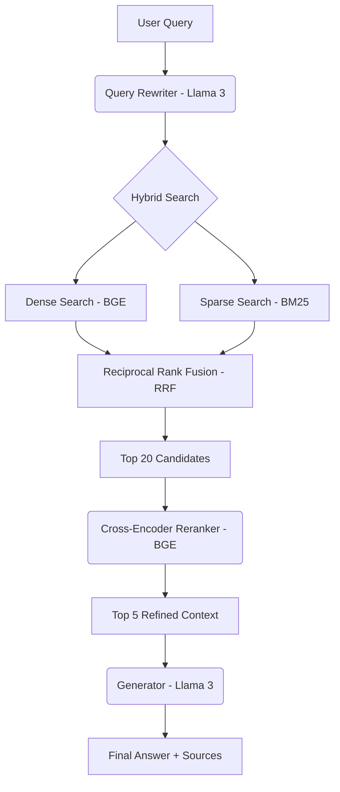

# Advanced Retrieval-Augmented Generation (RAG) Backend

A high-performance, production-grade retrieval pipeline designed for state-of-the-art Document AI applications. This system implements a modular multi-stage retrieval architecture using hybrid search (Dense + Sparse) and Cross-Encoder reranking.

## System Architecture

The project follows a modular RAG pipeline designed for maximum precision and recall:

1. **Document Ingestion Layer**: utilizes LangChain's directory loaders and recursive character splitting to process heterogeneous data sources (PDF, TXT).
2. **Hybrid Embedding Generation**:
    - **Dense Vectors**: Employs `BAAI/bge-base-en-v1.5` for deep semantic understanding.
    - **Sparse Vectors**: Generates BM25-compatible sparse embeddings for precise keyword matching.
3. **Vector Infrastructure (Qdrant)**: A high-performance vector database that manages dual-indexing (Dense + Sparse) and executes Reciprocal Rank Fusion (RRF) at the database level for optimized hybrid results.
4. **Ranking Refinement (Cross-Encoder)**: Implements a second-stage reranker using `BAAI/bge-reranker-base` to mitigate "lost in the middle" phenomena and ensure only the most relevant context reaches the generation stage.

## Technical Components

- **FastAPI**: Asynchronous Python framework for high-concurrency API performance.
- **Qdrant**: Vector search engine with native support for hybrid search and persistent disk storage.
- **FastEmbed**: Optimized inference library for BGE and BM25 embeddings, reducing latency and resource overhead.
- **Sentence-Transformers**: Powering the Cross-Encoder reranking stage.
- **Pydantic V2**: Robust data validation and settings management.

## Project Structure

```text
Advanced RAG/
├── app/
│   ├── api/          # Asynchronous endpoint definitions
│   ├── core/         # System configuration and global settings
│   ├── db/           # Database connection and collection management
│   ├── services/     # Modular pipeline components (Retrieval, Reranking, Loading)
│   └── main.py       # Application entry point
├── data/             # Persistent storage for raw source documents
├── storage/          # Local Qdrant database storage
├── .env              # Environment-specific configuration
├── requirements.txt  # Dependency specifications
└── README.md         # System documentation
```

## Setup and Installation

### 1. Environment Initialization
Initialize a isolated Python environment to manage dependencies:

```bash
python -m venv venv
# Windows
.\venv\Scripts\activate
# Linux/macOS
source venv/bin/activate
```

### 2. Dependency Management
Install the required production and inference libraries:

```bash
pip install -r requirements.txt
```

### 3. Configuration
Configure the `.env` file with appropriate API keys and model identifiers. The system is designed to be model-agnostic at the generation layer.

## Detailed Pipeline Walkthrough

The system processes queries through four distinct technical phases:



### 1. The Ingestion Phase (Preparation)
*   **Tech used:** `LangChain` (Loader), `RecursiveCharacterSplitter`, `FastEmbed` (Vectorization), `Qdrant` (Storage).
*   **Process:** Documents (PDFs/TXTs) are parsed and split into 500-character chunks with a 50-character overlap. Each chunk is vectorized using **BGE Embeddings** to generate both dense (semantic) and sparse (keyword) vectors, which are then stored in **Qdrant**.

### 2. The Retrieval Phase (Searching)
*   **Tech used:** `Ollama` (Llama 3 Rewriter), `FastEmbed` (BGE + BM25), `Qdrant` (Search Engine).
*   **Process:** The user's query is first expanded by **Llama 3** (Query Rewriting) to optimize it for vector search. The system then executes a **Parallel Hybrid Search** in Qdrant, combining semantic results (Dense) and exact keyword matches (BM25) using **Reciprocal Rank Fusion (RRF)**.

### 3. The Refinement Phase (Reranking)
*   **Tech used:** `Sentence-Transformers`, `BAAI/bge-reranker-base` (Cross-Encoder).
*   **Process:** To eliminate noise, the top 20 candidate documents are re-scored by a **Cross-Encoder Model**. This second-stage scoring ensures that only the most contextually relevant information is passed to the LLM.

### 4. The Generation Phase (Answering)
*   **Tech used:** `Ollama` (Llama 3 Inference), `FastAPI` (Orchestration).
*   **Process:** The top 5 refined results are injected into a specialized prompt alongside the original user query. **Llama 3** processes this context to generate a factual, hallucination-free response with cited sources.

### Technology & Role Mapping

| Technology | Role | Specific Task |
| :--- | :--- | :--- |
| **Llama 3 (Ollama)** | Search Architect | Rephrases messy user queries into search-optimized terms. |
| **Llama 3 (Ollama)** | Generator | Writes the final human-readable answer based on provided context. |
| **BGE Embedding** | Concept Translator | Converts text into mathematical vectors for semantic concept matching. |
| **BM25 (Sparse)** | Keyword Expert | Finds exact matches for names, technical codes, and specific terms. |
| **BGE Cross-Encoder** | Quality Judge | Reranks candidates to ensure only the most relevant context is used. |
| **Qdrant** | Knowledge Vault | Stores vectors and handles high-speed hybrid search logic. |
| **FastEmbed** | Inference Engine | Optimizes CPU performance for embedding and search operations. |
| **LangChain** | Document Carpenter | Manages PDF loading and splits text into manageable chunks. |
| **FastAPI** | System Interface | Manages the API endpoints and coordinates the async pipeline flow. |


## Performance Optimization

- **Local Persistence**: Qdrant is configured in persistence mode, allowing for rapid restarts without re-indexing.
- **Inference Caching**: Embedding and reranker models are cached locally using `fastembed` and `sentence-transformers` protocols.
- **Chunking Strategy**: Employs recursive splitting with configurable overlap to maintain semantic continuity across document fragments.

## License
This project is licensed under the MIT License.
