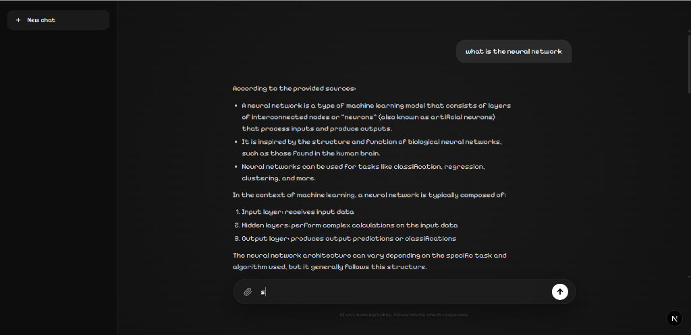
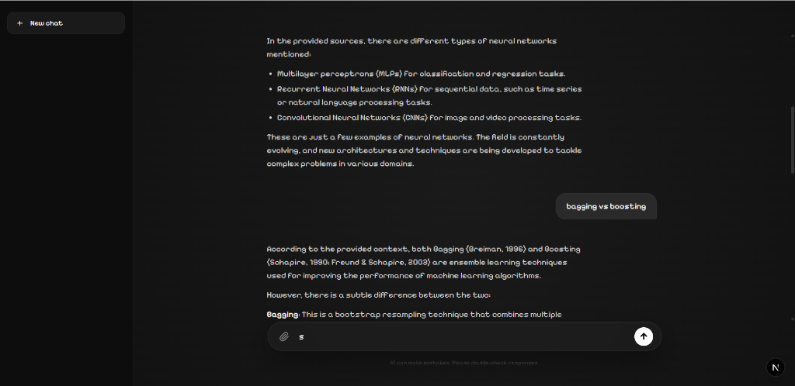

# Advanced Retrieval-Augmented Generation (RAG) Backend

A high-performance, production-grade retrieval pipeline designed for state-of-the-art Document AI applications. This system implements a modular multi-stage retrieval architecture using hybrid search (Dense + Sparse) and Cross-Encoder reranking.

## Project Interface

The application features a premium, pixel-styled dark-mode interface designed for a seamless user experience.


*Modern, centered homepage with a minimalist glassmorphism search bar.*


*Structured, cited responses with full Markdown support and clean typography.*


*High-precision retrieval and side-by-side concept explanation.*

### ✨ Recent Updates: Smart Highlighting
The UI now features **System-Level Notifications** for document indexing. When you upload a new document, the system provides a distinctive, highlighted confirmation bubble with a file icon, ensuring you know exactly when your knowledge base has been updated.

## System Architecture

The project follows an **Advanced RAG (Multi-Stage)** pipeline designed for maximum precision and recall:

1.  **Preparation (Ingestion Layer)**: Implements a **Small-to-Big (Parent-Child) Chunking** strategy. Documents are indexed as small chunks (400 chars) for precise vector matching, while preserving large parent contexts (1500 chars) for the LLM to maintain global coherence.
2.  **Analysis (Query Understanding)**: An LLM-powered **Query Analyzer** rephrases user input and automatically extracts **Metadata Filters** (e.g., specific book names) to restrict the search space.
3.  **Retrieval (HyDE + Hybrid Search)**:
    - **HyDE (Hypothetical Document Embeddings)**: Generates a "hypothetical answer" to bridge the semantic gap between questions and textbook content.
    - **Dense Vectors**: Uses `all-MiniLM-L6-v2` to match the HyDE answer against child chunks.
    - **Sparse Vectors**: Uses BM25 for exact keyword matching on the original query.
    - **Fusion**: Employs Reciprocal Rank Fusion (RRF) with metadata filtering in Qdrant.
4.  **Refinement (Reranking)**: A **Cross-Encoder Reranker** (`BAAI/bge-reranker-base`) re-scores the candidates to ensure high-precision grounding.
5.  **Generation**: The top refined results are expanded to their **Parent Context** and passed to the LLM for a hallucination-free, cited response.

```

## 🚀 Quick Start (Docker)

The fastest way to get the entire project (Backend + Frontend) running:

1. **Configure Environment**: Ensure your `.env` file contains your `GROQ_API_KEY`.
2. **Launch Stack**:
   ```bash
   docker-compose up --build -d
   ```
3. **Access the App**:
   - **Frontend UI**: [http://localhost:3000](http://localhost:3000)
   - **Backend API**: [http://localhost:8000](http://localhost:8000)

---

## Setup and Installation

### Option 2: Local Development
If you prefer running without Docker:

### Option 2: Local Development
If you prefer running without Docker:

1. **Backend Initialization**:
   ```bash
   python -m venv venv
   .\venv\Scripts\activate  # Windows
   pip install -r requirements.txt
   python -m app.main
   ```

2. **Frontend Initialization**:
   ```bash
   cd frontend
   npm install
   npm run dev
   ```

## Detailed Pipeline Walkthrough

The system processes queries through four distinct technical phases:

```mermaid
graph TD
    subgraph Ingestion_Layer [1. Ingestion Layer]
        Docs[Source Documents - PDF/TXT] --> Loader[Document Loader]
        Loader --> PChunk[Parent Chunks - 1500 chars]
        PChunk --> CChunk[Child Chunks - 400 chars]
        CChunk --> Embed[FastEmbed - MiniLM & BM25]
        Embed --> Qdrant_Store[(Qdrant Vector DB)]
    end

    subgraph Inference_Pipeline [2. Advanced Inference Pipeline]
        User[User Query] --> Analyzer[Query Analyzer - Llama 3.2]
        Analyzer -- Filters --> Hybrid[Hybrid Search Engine]
        Analyzer -- Rewritten Query --> HyDE[HyDE Generator - Llama 3.2]
        HyDE -- Hypothetical Answer --> Hybrid
        
        subgraph Retrieval [Retrieval & Expansion]
            Hybrid --> Dense[Dense Search - HyDE Vector]
            Hybrid --> Sparse[Sparse Search - Keywords]
            Dense --> Fusion[RRF Fusion + Metadata Filter]
            Sparse --> Fusion
        end

        Fusion -- Top Child Chunks --> ParentExt[Parent Context Expansion]
        ParentExt -- Rich Context --> Reranker[Cross-Encoder Reranker]
        Reranker -- Top Context --> LLM[Generator - Llama 3.2]
        LLM --> Output[Final Answer + Citations]
    end
```



### 1. The Ingestion Phase (Preparation)
*   **Tech used:** `LangChain` (Loader), `SemanticChunker`, `RecursiveCharacterSplitter`, `FastEmbed` (Vectorization), `Qdrant` (Storage).
*   **Process:** Documents (PDFs/TXTs) are loaded recursively from the data directory. The system optionally employs **Semantic Chunking** (meaning-based splitting) followed by a **Recursive Character Splitting** refinement (standard 500-character chunks with 100-character overlap). This ensures chunks are both semantically coherent and optimized for LLM context windows. Each chunk is then vectorized using **MiniLM-L6-v2 Embeddings** for hybrid storage in **Qdrant**.

### 2. The Retrieval Phase (Searching)
*   **Tech used:** `Ollama` (Llama 3.2 Rewriter), `FastEmbed` (MiniLM + BM25), `Qdrant` (Search Engine).
*   **Process:** The user's query is first expanded by **Llama 3.2** (Query Rewriting) to optimize it for vector search. The system then executes a **Parallel Hybrid Search** in Qdrant, combining semantic results (Dense) and exact keyword matches (BM25) using **Reciprocal Rank Fusion (RRF)**, retrieving the top 30 candidates.

### 3. The Refinement Phase (Reranking)
*   **Tech used:** `Sentence-Transformers`, `cross-encoder/ms-marco-MiniLM-L-6-v2` (Cross-Encoder).
*   **Process:** To eliminate noise, the top 30 candidate documents are re-scored by a **MS MARCO Cross-Encoder Model** trained specifically on passage relevance ranking. This second-stage scoring ensures that only the top 10 most contextually relevant chunks are passed to the LLM.

### 4. The Generation Phase (Answering)
*   **Tech used:** `Ollama` (Llama 3.2:1b Inference), `FastAPI` (Orchestration).
*   **Process:** The top 10 refined results (with source name and page number metadata) are injected into a specialized prompt alongside the original user query. **Llama 3.2:1b** processes this context to generate a factual, hallucination-free response with cited sources.

### Technology & Role Mapping

| Technology | Role | Specific Task |
| :--- | :--- | :--- |
| **Llama 3.2 (Ollama)** | Query Analyzer | Rephrases queries and extracts automated metadata filters. |
| **Llama 3.2 (Ollama)** | HyDE Generator | Creates hypothetical answers to improve semantic retrieval hits. |
| **Llama 3.2 (Ollama)** | Answer Generator | Synthesizes the final response using parent-child context. |
| **MiniLM-L6-v2** | Concept Translator | Converts text/HyDE into dense vectors for semantic matching. |
| **BM25 (Sparse)** | Keyword Expert | Ensures exact technical terms and names are never missed. |
| **BGE Reranker** | Quality Judge | Re-scores candidates to move the most relevant info to the top. |
| **Qdrant** | Knowledge Vault | Executes high-speed hybrid search with hard metadata filtering. |
| **FastAPI Lifespan** | Orchestrator | Manages the asynchronous flow and persistent resource lifecycle. |

## Model Benchmarking & Selection

The optimal generation model was selected through a systematic, data-driven benchmarking process.

### Methodology

A benchmarking script (`benchmark_models.py`) was developed to evaluate models across **35 curated questions** spanning 4 indexed textbooks:

| Book | Questions | Topics |
| :--- | :---: | :--- |
| Hands-On ML with Scikit-Learn & TensorFlow | 10 | Decision trees, random forests, SVMs, gradient descent, PCA, K-Means |
| Introduction to Machine Learning with Python | 5 | Supervised/unsupervised learning, overfitting, cross-validation |
| Deep Learning (Ian Goodfellow) | 8 | Neural networks, backpropagation, CNNs, RNNs, regularization, batch norm |
| AI: A Modern Approach (Russell & Norvig) | 12 | A* search, CSPs, Bayesian networks, MDPs, minimax, reinforcement learning |

Each question was run through the full RAG pipeline (retrieval → reranking → generation) on all candidate models and evaluated using an **LLM-as-Judge** approach:

- **Accuracy (0–10):** Factual correctness compared to ground truth
- **Faithfulness (0–10):** Whether the answer stayed faithful to the retrieved context without hallucination
- **Speed Score (0–1):** Normalized response time (faster = higher)

### Scoring Formula

```
Final Score = (Accuracy × 0.5) + (Faithfulness × 0.3) + (Speed × 0.2)
```

### Benchmark Results

| Rank | Model | Provider | Avg Accuracy | Avg Faithfulness | Avg Speed | Avg Time | **Final Score** |
| :---: | :--- | :--- | :---: | :---: | :---: | :---: | :---: |
| 🥇 **1** | **llama3.2:1b** | Ollama (Local) | **7.51 / 10** | 3.49 / 10 | 0.73 | 33.4s | **0.6253** |
| 2 | llama3:8b-instruct-q4_0 | Ollama (Local) | 5.69 / 10 | 3.51 / 10 | 0.69 | 37.5s | 0.5279 |
| 3 | llama-3.3-70b-versatile | Groq (Cloud) | 2.46 / 10 | 2.89 / 10 | 0.99 | 1.3s | 0.4080 |
| 4 | llama3 (8b base) | Ollama (Local) | 5.11 / 10 | 3.89 / 10 | 0.02 | 138.3s | 0.3760 |

### Key Findings

- **`llama3.2:1b` was selected as the default model**, achieving the highest combined score despite being the smallest model (1.3 GB). Its lightweight architecture enables fast inference while maintaining the highest accuracy on context-grounded answers.
- **Groq's 70B model** was the fastest (1.3s average) but scored lowest on accuracy — its instruction tuning made it too conservative, frequently refusing to answer from context.
- **llama3 (8B base)** had the best raw faithfulness (3.89) but was penalized heavily by its slow inference speed (138s average).

### Running the Benchmark

```bash
# Full 35-question benchmark across all configured models
python benchmark_models.py

# Quick interactive side-by-side comparison
python cli_compare.py "Your question here"
```

Output files:
- `benchmark_results_<timestamp>.csv` — Detailed per-question, per-model scores
- `benchmark_summary_<timestamp>.csv` — Aggregated model rankings

## Performance Optimization

- **Local Persistence**: Qdrant is configured in persistence mode, allowing for rapid restarts without re-indexing.
- **Inference Caching**: Embedding and reranker models are cached locally using `fastembed` and `sentence-transformers` protocols.
- **Advanced Chunking Strategy**: Employs a hybrid **Semantic + Recursive** splitting strategy. Semantic chunking preserves meaning-based boundaries, while recursive refinement ensures structural consistency and token-limit compliance.
- **Batched Ingestion**: Documents are ingested in batches of 500 to optimize RAM usage during large-scale indexing.

## License
This project is licensed under the MIT License.
