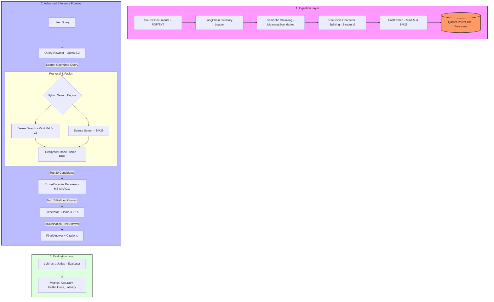

# Advanced Retrieval-Augmented Generation (RAG) Backend

A high-performance, production-grade retrieval pipeline designed for state-of-the-art Document AI applications. This system implements a modular multi-stage retrieval architecture using hybrid search (Dense + Sparse) and Cross-Encoder reranking.

## System Architecture

The project follows a modular RAG pipeline designed for maximum precision and recall:

1. **Document Ingestion Layer**: utilizes LangChain's directory loaders with advanced **Semantic Chunking** and recursive character splitting to process documents (PDF, TXT) with maximum contextual integrity.
2. **Hybrid Embedding Generation**:
    - **Dense Vectors**: Employs `sentence-transformers/all-MiniLM-L6-v2` for deep semantic understanding.
    - **Sparse Vectors**: Generates BM25-compatible sparse embeddings for precise keyword matching.
3. **Vector Infrastructure (Qdrant)**: A high-performance vector database that manages dual-indexing (Dense + Sparse) and executes Reciprocal Rank Fusion (RRF) at the database level for optimized hybrid results.
4. **Ranking Refinement (Cross-Encoder)**: Implements a second-stage reranker using `cross-encoder/ms-marco-MiniLM-L-6-v2` to mitigate "lost in the middle" phenomena and ensure only the most relevant context reaches the generation stage.

## Technical Components

- **FastAPI**: Asynchronous Python framework for high-concurrency API performance.
- **Qdrant**: Vector search engine with native support for hybrid search and persistent disk storage.
- **FastEmbed**: Optimized inference library for BGE and BM25 embeddings, reducing latency and resource overhead.
- **Sentence-Transformers**: Powering the Cross-Encoder reranking stage.
- **Pydantic V2**: Robust data validation and settings management.

## Project Structure

```text
Advanced RAG/
├── app/
│   ├── api/          # Asynchronous endpoint definitions
│   ├── core/         # System configuration and global settings
│   ├── db/           # Database connection and collection management
│   ├── services/     # Modular pipeline components (Retrieval, Reranking, Loading)
│   └── main.py       # Application entry point
├── data/             # Persistent storage for raw source documents
├── storage/          # Local Qdrant database storage
├── benchmark_models.py  # Automated model benchmarking & scoring
├── cli_compare.py       # Interactive side-by-side model comparison
├── evaluate_pipeline.py # RAGAS-based pipeline evaluation
├── ingest.py            # Document ingestion entrypoint
├── .env              # Environment-specific configuration
├── requirements.txt  # Dependency specifications
└── README.md         # System documentation
```

## Setup and Installation

### 1. Environment Initialization
Initialize a isolated Python environment to manage dependencies:

```bash
python -m venv venv
# Windows
.\venv\Scripts\activate
# Linux/macOS
source venv/bin/activate
```

### 2. Dependency Management
Install the required production and inference libraries:

```bash
pip install -r requirements.txt
```

### 3. Configuration
Configure the `.env` file with appropriate API keys and model identifiers. The system is designed to be model-agnostic at the generation layer.

## Detailed Pipeline Walkthrough

The system processes queries through four distinct technical phases:



### 1. The Ingestion Phase (Preparation)
*   **Tech used:** `LangChain` (Loader), `SemanticChunker`, `RecursiveCharacterSplitter`, `FastEmbed` (Vectorization), `Qdrant` (Storage).
*   **Process:** Documents (PDFs/TXTs) are loaded recursively from the data directory. The system optionally employs **Semantic Chunking** (meaning-based splitting) followed by a **Recursive Character Splitting** refinement (standard 500-character chunks with 100-character overlap). This ensures chunks are both semantically coherent and optimized for LLM context windows. Each chunk is then vectorized using **MiniLM-L6-v2 Embeddings** for hybrid storage in **Qdrant**.

### 2. The Retrieval Phase (Searching)
*   **Tech used:** `Ollama` (Llama 3.2 Rewriter), `FastEmbed` (MiniLM + BM25), `Qdrant` (Search Engine).
*   **Process:** The user's query is first expanded by **Llama 3.2** (Query Rewriting) to optimize it for vector search. The system then executes a **Parallel Hybrid Search** in Qdrant, combining semantic results (Dense) and exact keyword matches (BM25) using **Reciprocal Rank Fusion (RRF)**, retrieving the top 30 candidates.

### 3. The Refinement Phase (Reranking)
*   **Tech used:** `Sentence-Transformers`, `cross-encoder/ms-marco-MiniLM-L-6-v2` (Cross-Encoder).
*   **Process:** To eliminate noise, the top 30 candidate documents are re-scored by a **MS MARCO Cross-Encoder Model** trained specifically on passage relevance ranking. This second-stage scoring ensures that only the top 10 most contextually relevant chunks are passed to the LLM.

### 4. The Generation Phase (Answering)
*   **Tech used:** `Ollama` (Llama 3.2:1b Inference), `FastAPI` (Orchestration).
*   **Process:** The top 10 refined results (with source name and page number metadata) are injected into a specialized prompt alongside the original user query. **Llama 3.2:1b** processes this context to generate a factual, hallucination-free response with cited sources.

### Technology & Role Mapping

| Technology | Role | Specific Task |
| :--- | :--- | :--- |
| **Llama 3.2:1b (Ollama)** | Search Architect | Rephrases messy user queries into search-optimized terms. |
| **Llama 3.2:1b (Ollama)** | Generator | Writes the final human-readable answer based on provided context. |
| **MiniLM-L6-v2 Embedding** | Concept Translator | Converts text into mathematical vectors for semantic concept matching. |
| **BM25 (Sparse)** | Keyword Expert | Finds exact matches for names, technical codes, and specific terms. |
| **MS MARCO Cross-Encoder** | Quality Judge | Reranks candidates to ensure only the most relevant context is used. |
| **Qdrant** | Knowledge Vault | Stores vectors and handles high-speed hybrid search logic. |
| **FastEmbed** | Inference Engine | Optimizes CPU performance for embedding and search operations. |
| **LangChain** | Document Carpenter | Orchestrates PDF/TXT loading and advanced semantic/recursive chunking. |
| **FastAPI** | System Interface | Manages the API endpoints and coordinates the async pipeline flow. |

## Model Benchmarking & Selection

The optimal generation model was selected through a systematic, data-driven benchmarking process.

### Methodology

A benchmarking script (`benchmark_models.py`) was developed to evaluate models across **35 curated questions** spanning 4 indexed textbooks:

| Book | Questions | Topics |
| :--- | :---: | :--- |
| Hands-On ML with Scikit-Learn & TensorFlow | 10 | Decision trees, random forests, SVMs, gradient descent, PCA, K-Means |
| Introduction to Machine Learning with Python | 5 | Supervised/unsupervised learning, overfitting, cross-validation |
| Deep Learning (Ian Goodfellow) | 8 | Neural networks, backpropagation, CNNs, RNNs, regularization, batch norm |
| AI: A Modern Approach (Russell & Norvig) | 12 | A* search, CSPs, Bayesian networks, MDPs, minimax, reinforcement learning |

Each question was run through the full RAG pipeline (retrieval → reranking → generation) on all candidate models and evaluated using an **LLM-as-Judge** approach:

- **Accuracy (0–10):** Factual correctness compared to ground truth
- **Faithfulness (0–10):** Whether the answer stayed faithful to the retrieved context without hallucination
- **Speed Score (0–1):** Normalized response time (faster = higher)

### Scoring Formula

```
Final Score = (Accuracy × 0.5) + (Faithfulness × 0.3) + (Speed × 0.2)
```

### Benchmark Results

| Rank | Model | Provider | Avg Accuracy | Avg Faithfulness | Avg Speed | Avg Time | **Final Score** |
| :---: | :--- | :--- | :---: | :---: | :---: | :---: | :---: |
| 🥇 **1** | **llama3.2:1b** | Ollama (Local) | **7.51 / 10** | 3.49 / 10 | 0.73 | 33.4s | **0.6253** |
| 2 | llama3:8b-instruct-q4_0 | Ollama (Local) | 5.69 / 10 | 3.51 / 10 | 0.69 | 37.5s | 0.5279 |
| 3 | llama-3.3-70b-versatile | Groq (Cloud) | 2.46 / 10 | 2.89 / 10 | 0.99 | 1.3s | 0.4080 |
| 4 | llama3 (8b base) | Ollama (Local) | 5.11 / 10 | 3.89 / 10 | 0.02 | 138.3s | 0.3760 |

### Key Findings

- **`llama3.2:1b` was selected as the default model**, achieving the highest combined score despite being the smallest model (1.3 GB). Its lightweight architecture enables fast inference while maintaining the highest accuracy on context-grounded answers.
- **Groq's 70B model** was the fastest (1.3s average) but scored lowest on accuracy — its instruction tuning made it too conservative, frequently refusing to answer from context.
- **llama3 (8B base)** had the best raw faithfulness (3.89) but was penalized heavily by its slow inference speed (138s average).

### Running the Benchmark

```bash
# Full 35-question benchmark across all configured models
python benchmark_models.py

# Quick interactive side-by-side comparison
python cli_compare.py "Your question here"
```

Output files:
- `benchmark_results_<timestamp>.csv` — Detailed per-question, per-model scores
- `benchmark_summary_<timestamp>.csv` — Aggregated model rankings

## Performance Optimization

- **Local Persistence**: Qdrant is configured in persistence mode, allowing for rapid restarts without re-indexing.
- **Inference Caching**: Embedding and reranker models are cached locally using `fastembed` and `sentence-transformers` protocols.
- **Advanced Chunking Strategy**: Employs a hybrid **Semantic + Recursive** splitting strategy. Semantic chunking preserves meaning-based boundaries, while recursive refinement ensures structural consistency and token-limit compliance.
- **Batched Ingestion**: Documents are ingested in batches of 500 to optimize RAM usage during large-scale indexing.

## License
This project is licensed under the MIT License.
